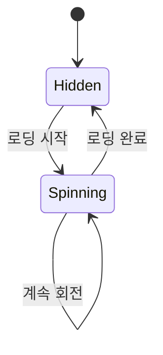
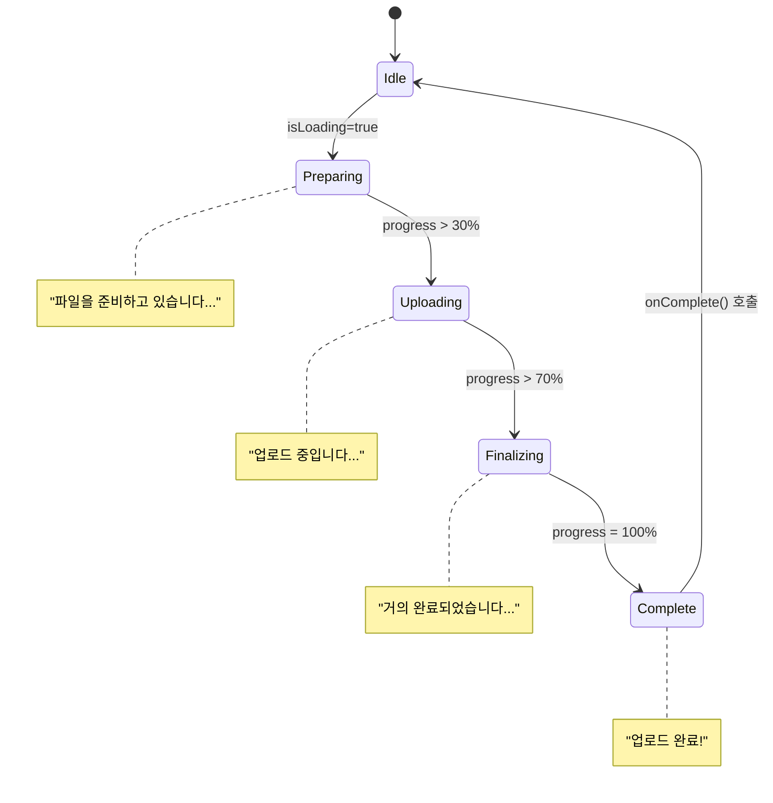

# 🌀 통합 상태 전환 가이드

## 목차
1. Button/카드/입력 등 상태 다이어그램
2. 상태별 속성/시각적 변화/전환 로직
3. 복합 상태 관리/플로우
4. 애니메이션/파티클/성능 상태
5. 에러/디버깅
6. ⚠️ 양립불가/오류 케이스

---

## 1. 상태 다이어그램 모음

### Button 상태 전환
```mermaid
stateDiagram-v2
    [*] --> Default
    Default --> Hover : 마우스 진입
    Default --> Loading : loading=true
    Default --> Disabled : disabled=true
    Hover --> Default : 마우스 이탈
    Hover --> Active : 마우스 클릭
    Hover --> Loading : loading=true
    Active --> Hover : 마우스 릴리즈
    Active --> Default : 마우스 이탈
    Loading --> Default : loading=false
    Loading --> Disabled : disabled=true
    Disabled --> Default : disabled=false
    Default --> [*]
```

### Input 상태 전환
```mermaid
stateDiagram-v2
    [*] --> Default
    Default --> Focused : 포커스 진입
    Default --> Error : error 메시지 설정
    Default --> Success : success 메시지 설정
    Default --> Disabled : disabled=true
    Focused --> Default : 포커스 이탈 (값 없음)
    Focused --> Filled : 포커스 이탈 (값 있음)
    Focused --> Error : 검증 실패
    Filled --> Focused : 포커스 재진입
    Filled --> Error : 검증 실패
    Filled --> Success : 검증 성공
    Error --> Focused : 포커스 진입
    Error --> Default : error 메시지 제거
    Error --> Success : 검증 성공
    Success --> Focused : 포커스 진입
    Success --> Default : success 메시지 제거
    Success --> Error : 검증 실패
    Disabled --> Default : disabled=false
    Default --> [*]
    Filled --> [*]
    Error --> [*]
    Success --> [*]
```

### LoadingSpinner 상태 전환


### ProgressLoader 상태 전환


### 카드/게임/미션/리워드/애니메이션/파티클 상태 다이어그램
- 카드, 게임, 미션, 리워드, 애니메이션, 파티클 등은 002_상태전환의 다양한 Mermaid/Graph/Sequence 다이어그램을 모두 포함하여 통합 반영

---

## 2. 상태별 속성/시각적 변화/전환 로직

### Button 상태별 속성
```typescript
interface ButtonStateMap {
  default: { scale: 1; opacity: 1; cursor: 'pointer'; userInteraction: true; };
  hover: { scale: 1.01; opacity: 1; cursor: 'pointer'; userInteraction: true; shadow: 'enhanced'; };
  active: { scale: 0.99; opacity: 1; cursor: 'pointer'; userInteraction: true; shadow: 'inner'; };
  loading: { scale: 1; opacity: 0.8; cursor: 'not-allowed'; userInteraction: false; icon: 'spinner'; };
  disabled: { scale: 1; opacity: 0.5; cursor: 'not-allowed'; userInteraction: false; };
}
```

### Input 상태별 시각적 변화
```typescript
interface InputStateMap {
  default: { borderColor: 'var(--color-neutral-dark-gray)'; backgroundColor: 'var(--color-primary-charcoal)'; labelPosition: 'placeholder'; underlineVisible: false; };
  focused: { borderColor: 'var(--color-gradient-2)'; backgroundColor: 'var(--color-primary-charcoal)'; labelPosition: 'top'; underlineVisible: true; scale: 1.01; shadow: 'focus-ring'; };
  filled: { borderColor: 'var(--color-neutral-dark-gray)'; backgroundColor: 'var(--color-primary-charcoal)'; labelPosition: 'top'; underlineVisible: false; };
  error: { borderColor: 'var(--color-semantic-error)'; backgroundColor: 'var(--color-semantic-error)/10'; labelPosition: 'top'; labelColor: 'var(--color-semantic-error)'; messageVisible: true; messageType: 'error'; };
  success: { borderColor: 'var(--color-semantic-success)'; backgroundColor: 'var(--color-semantic-success)/10'; labelPosition: 'top'; labelColor: 'var(--color-semantic-success)'; messageVisible: true; messageType: 'success'; };
  disabled: { borderColor: 'var(--color-neutral-dark-gray)/50'; backgroundColor: 'var(--color-primary-charcoal)/50'; opacity: 0.5; cursor: 'not-allowed'; userInteraction: false; };
}
```

### 카드/게임/미션/리워드/애니메이션/파티클 상태별 속성/로직
- 002_상태전환의 CardStateConfig, GameState, MissionProgressState, RewardStateConfig, GlowState, ParticleConfig 등 모든 타입/로직/매핑을 통합 반영

---

## 3. 복합 상태 관리/플로우
- 001_상태전환의 폼 상태 다이어그램, 상태별 UI 변화, useButtonState/useInputState 등 상태 관리 훅, useStateLogger 등 디버깅 훅
- 002_상태전환의 사용자 인터랙션 플로우(게임/미션/리워드 시퀀스 다이어그램) 모두 포함

---

## 4. 애니메이션/파티클/성능 상태
- 002_상태전환의 GlowState, ParticleState, PerformanceState, useViewportOptimization, useReducedMotion 등 성능/애니메이션 상태 관리 코드 모두 반영

---

## 5. 에러/디버깅
- 002_상태전환의 ErrorStateConfig, useStateDebugger, logStateTransition 등 에러/디버깅 코드 모두 반영

---

## 6. ⚠️ 양립불가/오류 케이스
- Mermaid 다이어그램에서 동일 상태명이라도 실제 전이 조건/구조가 다를 경우(예: Button의 'active'와 Card의 'active'는 의미가 다름) 반드시 컴포넌트별로 구분해서 사용해야 함
- Card/Game/Mission/Reward 등에서 상태명은 같아도 내부 속성/로직이 다르므로, 타입/로직을 혼용하지 말 것
- 일부 상태별 속성(예: scale, opacity, transition 등)은 컴포넌트별로 다르므로, 공통화하지 말고 각 컴포넌트에 맞게 분리 구현할 것
- 폼 상태와 카드/버튼 상태는 전이 플로우가 다르므로, 상태 관리 훅도 별도로 구현할 것

---

## 🧩 추가 상태 다이어그램/플로우 (003_개발스팩)

### TokenBalanceWidget 상태 다이어그램
```
┌─────────────┐
│   LOADING   │
└─────┬───────┘
      ▼
┌─────────────┐    amount < 100K     ┌─────────────┐
│   NORMAL    │─────────────────────▶│  CRITICAL   │
└─────┬───────┘                     └─────────────┘
      ▼                                     │
┌─────────────┐                            │
│   WARNING   │────────────────────────────┘
└─────────────┘    amount < 100K

States:
- LOADING: 데이터 로딩 중
- NORMAL: 정상 상태 (녹색)
- WARNING: 경고 상태 (주황색)
- CRITICAL: 위험 상태 (빨간색)

Triggers:
- amount: 토큰 수량 변화
- status: 직접 상태 변경
```

### CJChatBubble/CJAIChatBubble 상태 다이어그램
```mermaid
stateDiagram-v2
    [*] --> Default
    Default --> Sending : 메시지 전송 중
    Default --> Received : 메시지 수신 완료
    Default --> Error : 전송 실패
    Sending --> Default : 전송 취소
    Sending --> Received : 메시지 수신
    Sending --> Error : 전송 오류
    Received --> Default : 확인 후 기본 상태로
    Error --> Default : 오류 수정 후 재전송
    Default --> [*]
```

---

## [003_컴포넌트스택/004_상태전환/005_상태전환 추가/보완 내역]

### TokenBalanceWidget/CJChatBubble/CJAIChatBubble 상태 전환 (003/005 기준)
- TokenBalanceWidget: 상태 다이어그램(Initializing, Loading, Normal, Warning, Critical, Error, Refreshing 등), 상태별 속성(status, subState, amount, change, animationType 등), 상태별 애니메이션(마운트/값변경/상태변경/변화방향), 임계값 상수(100,000/1,000,000)
- CJChatBubble: 상태 다이어그램(closed, opening, open, typing, sending, waitingResponse, receivingResponse, closing, error 등), 상태별 속성(status, messages, inputValue, isLoading, error, unreadCount, isOpen, isAnimating, connectionStatus, aiTyping 등), 아바타 감정별 스타일/애니메이션, 타이핑 효과, 음성 토글 등
- CJAIChatBubble: 상태 다이어그램(closed, open, loading, 메시지 상태 empty/pending 등), 상태별 속성(position, onSendMessage, messages, isOpen 등), 위치별 CSS 클래스, 메시지 전송 플로우, 실시간 업데이트/웹소켓 예시, 커스터마이징(테마/애니메이션/반응형/접근성)

### 상태 관리/구현/테스트 패턴 (003/005 기준)
- React Hook 기반 상태 관리(useTokenWidget, useChatBubble 등), 상태 머신 팩토리(StateMachineFactory), 상태 구독/전이 테스트, 실시간 업데이트/AI 상태 변화 시뮬레이션, 커스터마이징(테마/애니메이션/반응형/접근성)

---

## [양립 불가/오류 케이스]
- 005의 상태명(status, subState 등)과 통합 가이드의 상태명/구조가 다를 수 있음(통합시 기준 통일 필요)
- 003/005의 TokenBalanceWidget, CJChatBubble, CJAIChatBubble 등은 기존 통합 가이드에 없는 신규/확장 컴포넌트(추가시 별도 논의 필요)
- 상태별 속성/로직/애니메이션/테스트/커스터마이징 등은 컴포넌트별로 다르므로, 공통화하지 말고 각 컴포넌트에 맞게 분리 구현할 것
- 상태 머신/팩토리/구독/테스트 등 고급 패턴은 기존 통합 가이드에 미포함(추가시 별도 논의 필요)

---

※ 본 추가 내역은 통합_상태전환_가이드.md의 기준을 변경하지 않으며, 003/004/005_상태전환의 추가/보완/양립불가 사항만 정리합니다.
